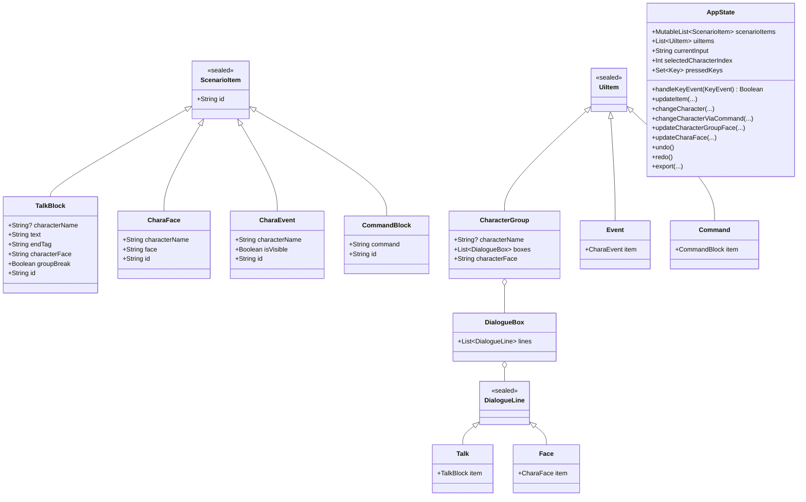
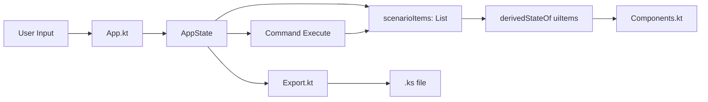

# README.dev.md

## 1. 概要
`kirikiri_editor` は、シナリオ編集用の Compose Desktop アプリです。  
内部的には `ScenarioItem` の線形リストを単一のソースオブトゥルースとして保持し、UI描画時に `UiItem` へ再構成します。

- 状態管理: `AppState`
- 描画: `App` / `Components`
- 永続化: `Export`
- 変更履歴: Command パターン (`undo` / `redo`)

---

## 2. モジュール構成
- `composeApp/src/jvmMain/kotlin/org/meirie/project/app/App.kt`
  - 画面全体の Compose エントリ
- `.../AppState.kt`
  - 編集状態、キーボード処理、Command実行、UI再構成
- `.../ScenarioItem.kt`
  - 永続データモデル（ドメイン）
- `.../UiItem.kt`
  - 表示向けデータモデル
- `.../Components.kt`
  - リスト表示/編集コンポーネント
- `.../Export.kt`
  - `.ks` 出力
- `.../command/*.kt`
  - Undo/Redo対象の操作

---

## 3. クラス図

---

## 4. データフロー

---

## 5. 主要モデル詳細

## `ScenarioItem`
- `TalkBlock`: 本文、終了タグ、話者、表情、グループ分割情報を保持
- `CharaFace`: 表情変更命令をインラインで保持
- `CharaEvent`: 表示/非表示などのイベント
- `CommandBlock`: 生コマンド行

## `UiItem` / `DialogueLine`
`AppState.uiItems` で `scenarioItems` を再構成し、以下を実現。
- 同一話者の連続 `TalkBlock` を `CharacterGroup` に集約
- `endTag` の `[cm]` や `groupBreak` で `DialogueBox` を分割
- `CharaFace` は `DialogueLine.Face` としてボックス内に混在表示

---

## 6. `AppState` 関数仕様

## `handleKeyEvent(keyEvent)`
責務:
- `pressedKeys` 管理
- F1〜F5の話者選択
- Enter系ショートカット解釈
- `TalkBlock` / `CharaFace` 追加

ロジック:
1. KeyDown/KeyUpで `pressedKeys` 更新
2. Fキー長押しリピート (`KeyDown` 再発) は無視
3. `F1..F5 + Enter` の場合 `CharaFace` を追加
4. 通常 Enter 系は endTag を決定して `TalkBlock` 追加

補助:
- `findLatestFaceByCharacterName` で表情継承
- `findLatestCharacterBoxIndex` で Face追加後の話者選択復帰先を決定

## `uiItems` (derivedStateOf)
責務:
- `scenarioItems` から描画構造を都度再構築

注意:
- 全件再構築前提（編集時の周辺影響反映を優先）

## `updateItem`
- `TalkBlock` の `text` / `endTag` を `UpdateItemCommand` 経由で更新

## `changeCharacter` / `changeCharacterViaCommand`
- クリック対象を起点に、同一話者かつ `groupBreak=false` の連続範囲を更新
- Undo/Redo対象化のため `ChangeCharacterCommand` を利用

## `updateCharacterGroupFace`
- グループ先頭 `TalkBlock` ID から連続範囲を解決して表情を一括更新
- `UpdateCharacterGroupFaceCommand` に委譲

## `updateCharaFace`
- `CharaFace` 単体の face 更新
- `UpdateCharaFaceCommand` により Undo/Redo 対応

## `undo` / `redo`
- 最大 50 件の履歴を保持
- `executeCommand` で redoStack をクリア

## `export`
- `Export.exportScenario` を呼び出し、Snackbarメッセージを設定

---

## 7. Command パターン
共通インターフェース: `Command.execute()` / `Command.undo()`

- `AddItemCommand`
  - append / remove
- `UpdateItemCommand`
  - `TalkBlock` の本文・タグ差し替え
- `ChangeCharacterCommand`
  - `changeCharacter` を execute/undo 双方で呼ぶ
- `UpdateCharacterGroupFaceCommand`
  - グループ範囲の face 一括変更（変更前マップ保持）
- `UpdateCharaFaceCommand`
  - `CharaFace` 単体 face 変更（old/new 切り替え）

---

## 8. UI 構成 (`Components.kt`)

## `ScenarioList`
- `UiItem` を `LazyColumn` で表示

## `CharacterGroupItem`
- 左: 話者表示（Fキー+クリックでグループ話者変更）
- 右: グループ表情プルダウン
  - `TalkBlock` を含むグループでのみ有効

## `DialogueBoxItem`
- `DialogueLine.Talk`
  - クリックでインライン編集（text/tag）
- `DialogueLine.Face`
  - 右側プルダウンで `CharaFace.face` を更新

## `CharacterSelector`
- 現在話者（F1〜F5）の可視化

## `ScenarioInputArea`
- 下部入力欄
- Enterバリエーションの操作ガイドを表示

---

## 9. エクスポート仕様 (`Export.kt`)
- 出力先: `./scenarios/{name}_{counter}.ks`
- エンコーディング: UTF-8 with BOM
- `TalkBlock`:
  - 新規ボックス開始時に `[character face]`
  - text + endTag を連結
- `CharaEvent`:
  - コメント行として出力
- `CommandBlock`:
  - そのまま出力
- `CharaFace`:
  - `[character face]` 行として出力

---

## 10. 既知の設計方針
- 編集時に周辺要素が影響を受ける要件のため、`uiItems` は都度再構築方式
- データ整合性より先に見た目だけ変わる問題を避けるため、ヘッダfaceは `item.characterFace` を直接表示

---

## 11. 実行・ビルド
### 実行
- Windows: `.\gradlew.bat :composeApp:run`
- macOS/Linux: `./gradlew :composeApp:run`

### コンパイル確認
- Windows: `.\gradlew.bat :composeApp:compileKotlinJvm`

---

## 12. 変更時のおすすめ確認ポイント
- Fキー長押し時に話者が暴れないか
- `Fキー + Enter` の Face追加後、話者選択が最新CharacterBoxに戻るか
- `CharaFace` の face 変更が Undo/Redo で往復できるか
- グループface変更ボタンが `TalkBlock` なし時に無効になっているか
- Export の `[character face]` 出力が意図どおりか
